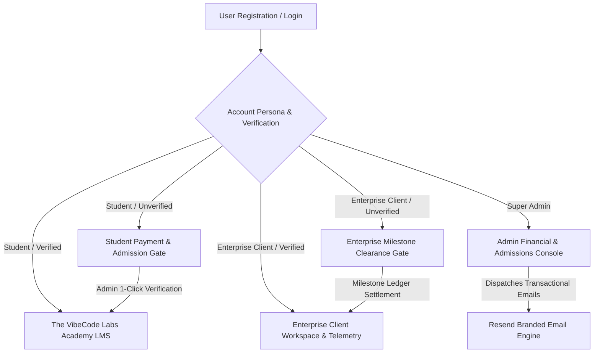

# Zeerocodes Platform (Teach • Build • Protect)

[](https://github.com/zeerocodez/website/actions/workflows/ci.yml)
[-016B61?style=flat&logo=shield)](https://zeerocodes.com/#verify?cert=VIBECERT-2026-0881)
[](https://opensource.org/licenses/MIT)

**Zeerocodes** is a Lagos-based AI systems engineering, automation, and cybersecurity company led by **Nuel Effiong (Emmanuel Effiong)**. The platform integrates three core operational divisions under a unified user and client experience:

1. **Teach (The VibeCode Labs / Academy)**: High-impact online cohort training in AI engineering, n8n automations, WhatsApp bots, and full-stack software development with 4 levels, 88 interactive code labs, Saturday live clinics, and cryptographically verifiable **VibeCert™** certification.
2. **Build (Automation Studio)**: Custom web applications, enterprise client portals, 90-second conversational WhatsApp invoicing bots, and automated Paystack/Flutterwave transaction reconciliation for African high-growth businesses.
3. **Protect (VibeScan)**: Independent AST static security scanner and **VibeCert™** audit trust badge verification for applications built with AI assistants (Cursor, Lovable, v0, Claude), audited against the **OWASP Top 10 for LLM Applications**. Official GitHub repository: [github.com/zeerocodez/vibescan](https://github.com/zeerocodez/vibescan).

---

## 🏛️ Platform Architecture & User Flows



### 1. Student Builder Flow
- New students enter a `pending_verification` state awaiting ledger confirmation.
- Admin verifies admission in 1-click from the **Student Admissions Hub**.
- Automated email dispatches `welcome_student` (Cohort Admission Pass) + `payment_receipt`.
- Unlocks 4 Levels, 88 Code Labs, Saturday Live Clinics, and VIP Discord.

### 2. Enterprise Client Flow
- Enterprise partners enter a dedicated scoping & invoice verification state.
- Once verified, unlocks the **Dedicated Enterprise Users Dashboard**:
  - **Executive Overview**: Active builds, 99.99% SLA Uptime, 420 Hrs/Mo Reclaimed, AST Grade A (98/100).
  - **Studio Projects & Sprints**: 5-stage milestone roadmap, staging prototypes, and deliverables.
  - **Autonomous Pipelines**: Live telemetry event stream (WhatsApp bots, Paystack auto-reconciliation, Kyber encryption).
  - **Security & OWASP Governance**: Active guardrails (HMAC, RLS, Prompt Injection Shield, PII Redactor) & VibeCert™ badge embedder.
  - **Milestone Invoicing**: 1-click Paystack settlement & cryptographic PDF receipts.
  - **Multi-Seat Organization Team**: Team seat permissions.
  - **24/7 SLA Hotline**: Direct emergency channel with Lead Systems Architect Nuel Effiong.

### 3. Automated Admin Verification & Transactional Email Pipeline
- Integrated ledger in `js/admin.js` for 1-click payment verification.
- Automated email dispatch via `js/emails.js` and `js/notifications.js` for all transaction events.

---

## 🔒 Security Engineering & Guardrails

- **Zero Hardcoded Secrets**: All credentials reside in `.env` (enforced via `.gitignore`).
- **Constant-Time Webhook Verification**: All Paystack and Flutterwave webhooks are validated using `crypto.timingSafeEqual` over HMAC SHA-512 signatures to prevent timing side-channel attacks.
- **Database Row Level Security (RLS)**: PostgreSQL schema enforces strict tenant isolation via `auth.uid() = user_id`.
- **Sliding-Window Rate Limiter**: Server-side in-memory rate limiting bounds abuse to 60 req/min per IP.
- **AST Static Scanner & OWASP LLM Top 10**: Real-time detection of exposed secrets, missing RLS, and prompt injection vectors.

---

## 🚀 Quick Start & Local Development

### 1. Prerequisites
- Node.js (v18.x or v20.x recommended)
- Git

### 2. Installation
```bash
# Clone the repository
git clone https://github.com/zeerocodez/website.git
cd website

# Install dependencies
npm install

# Copy environment variables template
cp .env.example .env

# Run automated security and test suite
npm test

# Start the local development server
npm start
# Server will run on http://localhost:8080 (Health probe: http://localhost:8080/healthz)
```

---

## ⚡ Deployment Options

### Option 1: Vercel (Recommended for Edge)
```bash
# Install Vercel CLI
npm install -g vercel

# Deploy preview
vercel

# Deploy to production
vercel --prod
```

### Option 2: Docker / Containerized Node
```bash
# Start server with production environment
NODE_ENV=production node server.js
```

### Option 3: GitHub Pages
Configured via `.github/workflows/deploy.yml` on push to `main`.

---

## 🧪 Automated Test Suite

Run the full security, HMAC validation, rate limiting, and verification gate tests:
```bash
node test/run-tests.js
```
```text
======================================================
🔒 RUNNING ZEEROCODES SECURITY & ARCHITECTURE TEST SUITE
======================================================

  ✓ PASS: Constant-Time HMAC SHA-512 matches authentic signature
  ✓ PASS: HMAC SHA-512 rejects tampered webhook payload
  ✓ PASS: Input sanitizer strips potential script tags & malicious XSS vectors
  ✓ PASS: Idempotency engine prevents duplicate payment fulfillment
  ✓ PASS: Rate limiter correctly bounds window and resets quota
  ✓ PASS: Verification guard blocks unverified students & enterprise clients from dashboards
  ✓ PASS: Transactional email templates generate valid HTML and inject metadata

======================================================
SUMMARY: 7/7 Tests Passed (100% Success)
======================================================
```

---

## 📄 License & Security Policy

- **License**: [MIT License](LICENSE)
- **Security Policy**: [SECURITY.md](SECURITY.md) — Responsible disclosure response within <12 hours.
- **Contributing**: [CONTRIBUTING.md](CONTRIBUTING.md)
